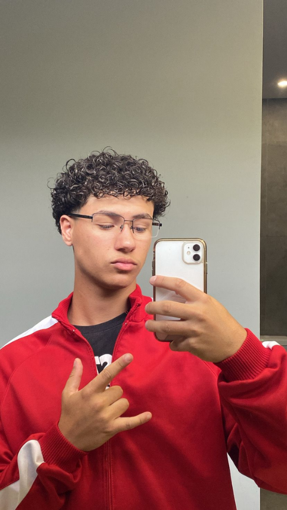
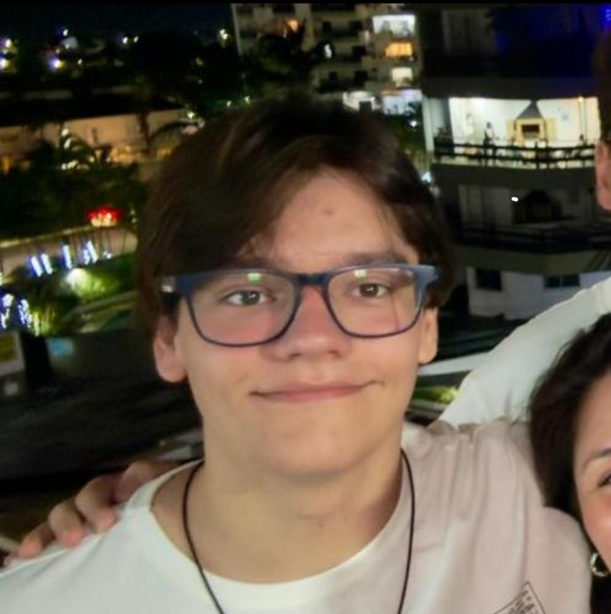

# Vencedores do NEXT — FIAP Challenge & GoodWe

Bem-vindos ao perfil oficial da nossa equipe! Somos um grupo de 5 alunos da **FIAP** unidos por um único objetivo: desenvolver soluções inovadoras e de alto impacto para vencer o **FIAP NEXT**, superando todos os desafios propostos ao longo das Sprints do Challenge.

---

## Sobre o Projeto / Challenge

Nesta edição, a parceira do Challenge é a **GoodWe**, líder em soluções de energia renovável e inversores solares. Nosso foco é unir tecnologia de ponta, boa arquitetura e inteligência de negócios para entregar uma plataforma robusta, escalável e sustentável.

---

## Integrantes da Equipe

| Foto | Nome Completo | RM | Função | GitHub |
| :---: | :--- | :---: | :--- | :---: |
|  | **Enzo Seiji Delgado Tabuchi** | 573156 | 👑 Líder / ⚙️ Backend / 🤖 IA | [@enzo-tabuchi-github](https://github.com/enzotabuchii) |
|  | **Henrique Almeida Lucareli** | 569183 | 📊 Dados / 📱 Mobile | [@henrique-lucareli-github](https://github.com/HenriqueAlmeidaLucareli) |
|  | **Leonardo Scotti Tobias** | 573305 | 🎨 Frontend | [@leonardo-scotti-github](https://github.com/leonardo-scotti) |
|  | **Luca Almeida Lucareli** | 569061 | ⚙️ Backend / 📊 Dados | [@luca-lucareli-github](https://github.com/LucaLucareli) |
|  | **Natan Silva da Costa** | 573100 | 📱 Mobile / 🎨 Frontend | [@natan-costa-github](https://github.com/natan-costa01) |

---

## Repositórios do Projeto

### Aplicação Principal (GoodWe Challenge)
- **[GoodWe Challenge Front](https://github.com/vencedoresdonext/goodwe-challenge-front):** Interface web do projeto desenvolvida em TypeScript.
- **[GoodWe Challenge Service](https://github.com/vencedoresdonext/goodwe-challenge-service):** API / Backend responsável pelas regras de negócio em TypeScript.
- **[GoodWe Challenge Mobile](https://github.com/vencedoresdonext/goodwe-challenge-mobile):** Aplicativo da solução.

---

## Tecnologias & Ferramentas

  

